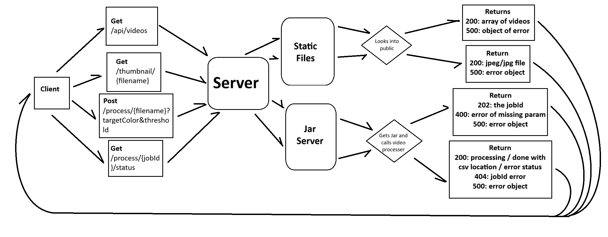

**Server**  
-
routes:  
- /api/videos (200 & 500)  
ex 200: ["intro.mp4", "demo.mov"]  
ex 500: {"error": "Error reading video directory"}
- /thumbnail/:filename (200 & 500)  
ex 200: Content-Type: image/jpeg  
ex 500: {"error": "Error generating thumbnail"}
- /process/:filename?targetColor&threshold (202 & 400 & 500)  
ex 202: {"jobId": "123e4567-e89b-12d3-a456-426614174000"}  
ex 400: {"error": "Missing targetColor or threshold query parameter."}  
ex 500: {"error": "Error starting job"}
- /process/:jobId/status (200(ok) & 200(done) & 200(error) & 404 & 500)  
ex 200(ok): {"status": "processing"}  
ex 200(done): {"status": "done", "result": "/results/intro.mp4.csv"}  
ex 200(error): {"status": "error", "error": "Error processing video: Unexpected ffmpeg error"}  
ex 404: {"error": "Job ID not found"}  
ex 500: {"error": "Error fetching job status"}  

All return objects, thumbnail route returns image, videos returns a list of videos from the static folder.  
Use UUIDs for the jobId (look for library on express for it)  
Video processing routes access the jar. Videos and thumbnails access the static folder for files.  
Make the job in the jar separate from the routes so it can run in the background.  
Maybe use a server for storing the status?

